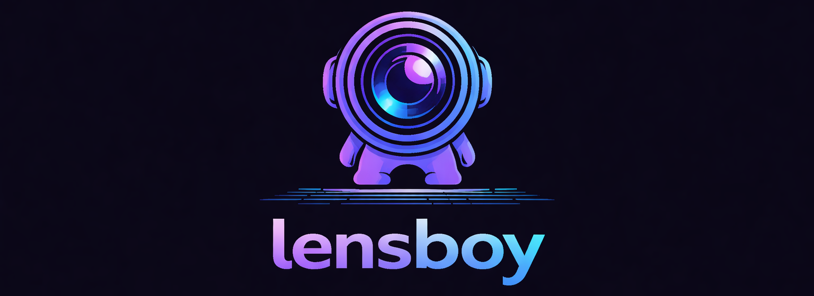
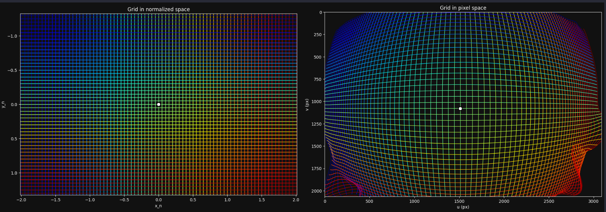
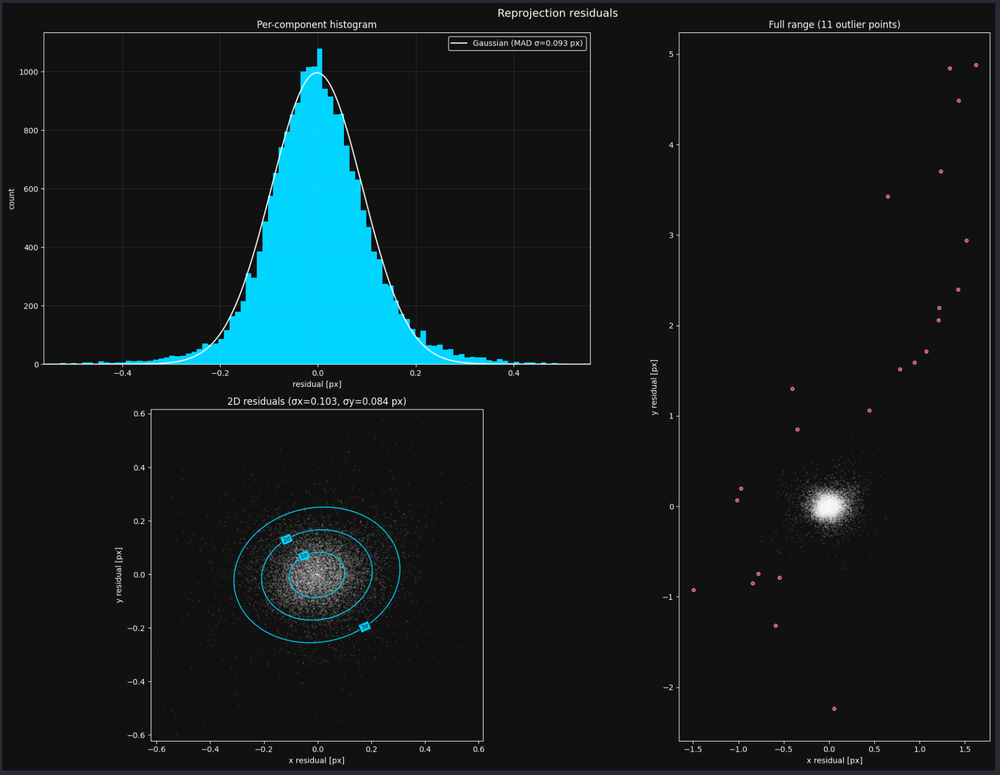
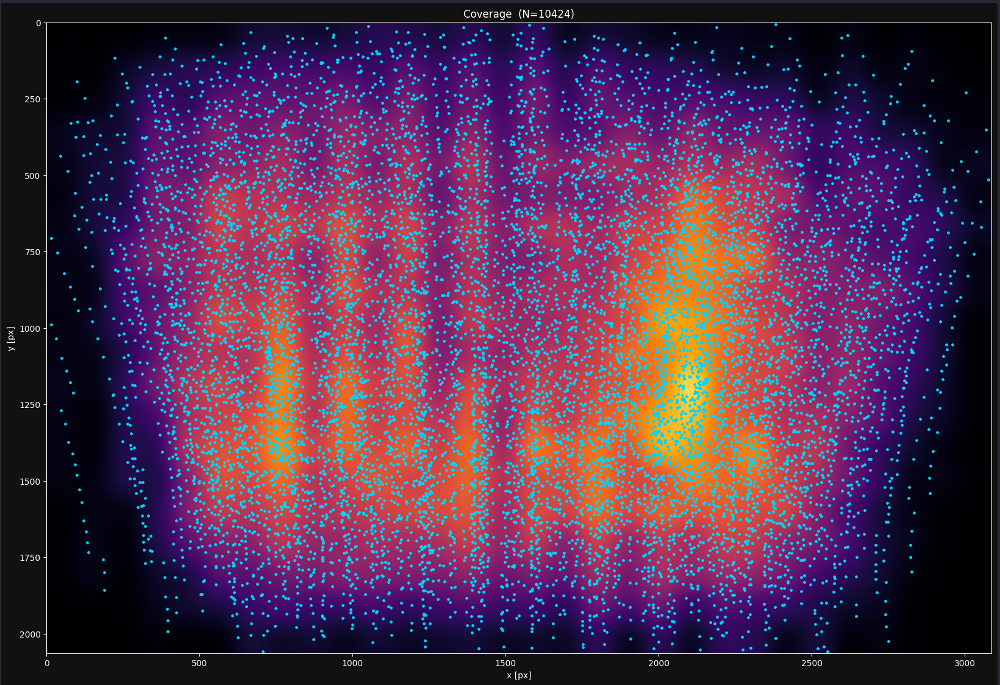
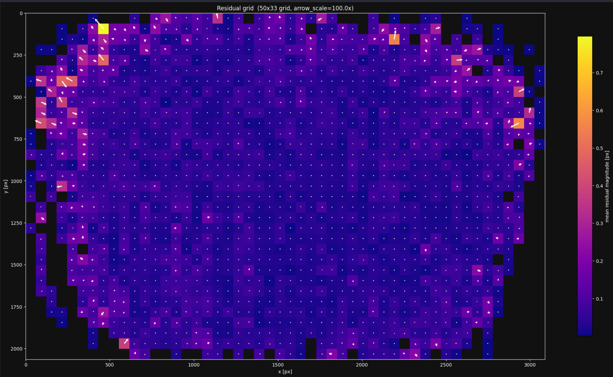
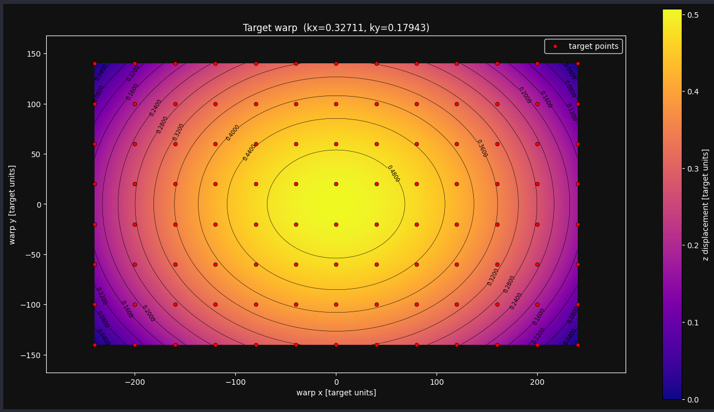

<p align="center">
  
</p>

<p align="center">
  <a href="https://pypi.org/project/lensboy/"></a>
  <a href="https://pypi.org/project/lensboy/"></a>
  <a href="https://github.com/Robertleoj/camcal/blob/main/LICENSE"></a>
</p>

Camera calibration for vision engineers. Maximally powerful, minimally complex.

One job: fit camera models and verify the results. OpenCV models when they work, spline-based distortion when they don't.

## Why lensboy

Even for standard OpenCV models, lensboy gives you better calibrations than raw `cv2.calibrateCamera` (see [model comparison notebook](examples/model_comparison.ipynb)). This is achieved mainly by two means:

- **Automatic outlier filtering** removes bad detections
- **Target warp estimation** compensates for non-flat calibration boards

For cheap or wide-angle lenses where OpenCV's polynomial distortion model isn't enough, lensboy offers spline-based distortion models that can capture arbitrary distortion patterns.

Lensboy also offers strong **analysis tools** to verify your calibration is actually good.

## Quick example

```python
import lensboy as lb

# detect calibration target in images (works with any target — charuco is just a built-in utility)
target_points, frames = lb.extract_frames_from_charuco(board, imgs)

# calibrate
result = lb.calibrate_camera(
    target_points, frames,
    camera_model_config=lb.OpenCVConfig(
        image_height=h, image_width=w, initial_focal_length=1000,
    ),
)

# save
result.optimized_camera_model.save("camera.json")
```

Need more accuracy? Just swap the config — same API, way more powerful:

```python
result = lb.calibrate_camera(
    target_points, frames,
    camera_model_config=lb.PinholeSplinedConfig(
        image_height=h, image_width=w, initial_focal_length=1000,
    ),
)
```

## Analysis tools

Plots for residuals, distortion, detection coverage, and more. See the [example notebooks](examples/).

<p align="center">
  <br>
   <br>
   
</p>

## Install

For calibration time, includes analysis and plotting tools:

```bash
pip install lensboy[analysis]
```

For loading and using the camera models:

```bash
pip install lensboy
```

## Getting started

See the [quickstart notebook](examples/quickstart.ipynb) for a full walkthrough covering both OpenCV and spline models.

## Spline models

Spline models use B-spline grids instead of polynomial coefficients, so they can capture arbitrary distortion patterns. This approach is inspired by [mrcal](https://mrcal.secretsauce.net/), but lensboy is designed to be easier to use and trivial to install.

The calibrated model converts to a pinhole model with undistortion maps, so you can use it anywhere:

```python
pinhole = spline_model.get_pinhole_model()
undistorted = pinhole.undistort(image)
```
