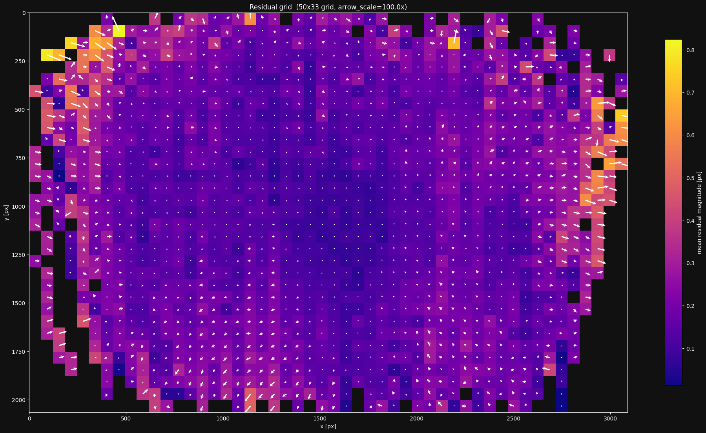
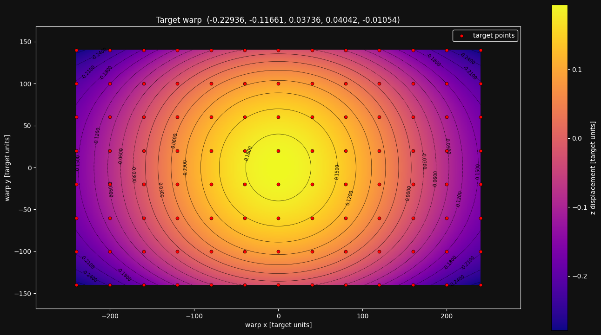
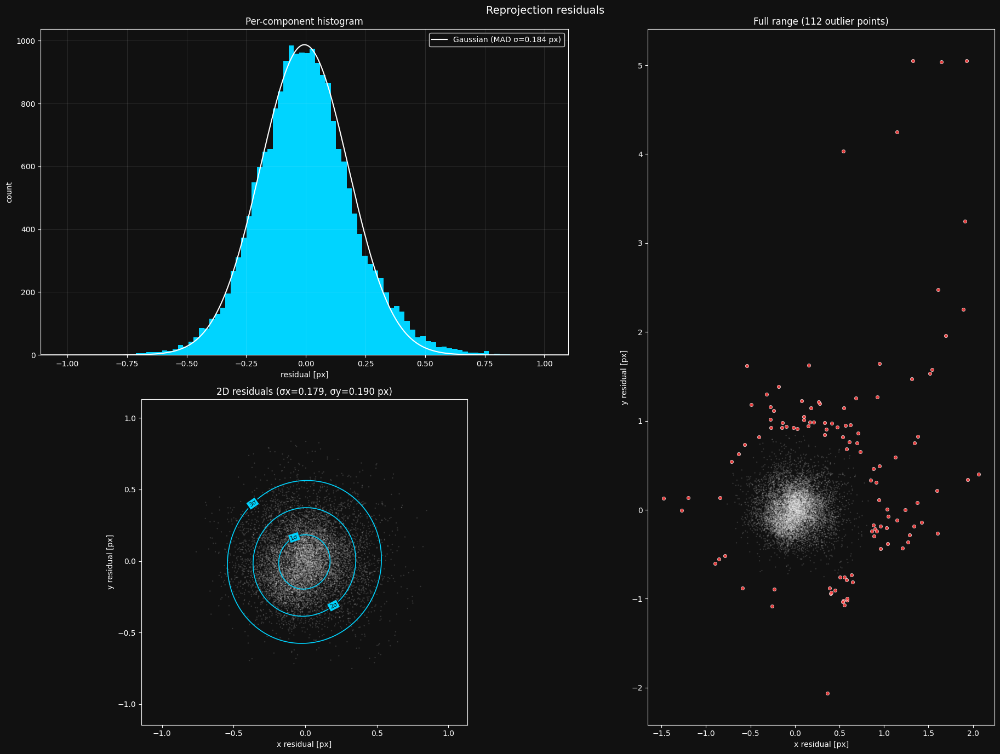
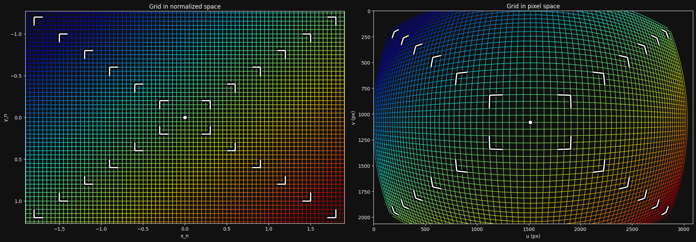

# Camera Calibration Done Right

### A practical guide using lensboy

This is a practical guide on how to calibrate a camera using lensboy. I'll walk though all the steps you need to get a quality calibration. Throughout the guide, I'll be calibrating this camera as an example:

[insert picture of camera]

## 1. What is Camera Calibration?

A camera is a sensor that captures a detailed projection of the 3D world onto a 2D plane. To make the most of this tremendously useful sensor, we often require a precise mathematical model of the projection.

Each camera is unique, and the exact mapping depends on the physical properties of your specific lens and sensor assembly. All camera lenses introduce some level of nonlinear distortion which must be modeled.

[Insert visual]

**Camera intrinsics calibration** is the process of finding the parameters of a mathematical function that describes this 3D-to-2D mapping. Once you have this function, you can:

- **Undistort images** - remove lens distortion to get straight lines and accurate measurements
- **Measure in 3D** - go from pixel coordinates back to real-world coordinates
- **Localize** - use known world features and camera observations to locate the camera in 3D
- **Combine multiple cameras** - stereo vision, multi-camera rigs, etc.

The calibration function is typically a simple linear **pinhole model** (focal length, principal point) plus a **distortion model** that captures how your lens deviates from an ideal pinhole. Different distortion models exist with varying numbers of parameters - finding the right level of complexity for your lens is a key part of the calibration process.

## 2. Preparing Your Lens

Before you calibrate, your lens needs to be in its final mechanical state. Calibration captures the exact geometry of the optics at the moment you collect data - if anything moves afterward, the calibration is invalid.

1. **Focus and tune** - set your focus distance, aperture, and zoom to match your application. If you have a lens with variable focus, get the image looking exactly how you need it at your working distance.

2. **Lock everything down** - once the lens is tuned, make sure nothing can shift. Use set screws if your lens has them. For critical applications, apply a small amount of loctite to the focus and zoom rings. Even a tiny rotation of the focus ring changes the calibration.

This may seem overly cautious, but a lens that drifts between calibration and deployment will silently degrade your results. It can be hard to detect when the camera is out in the field, so prevention is your best option, and first line of defence.

My lens has adjustable focus, but also two threads for a mount converter. I'll first lock the mount threads with locktite. Then I'll focus the camera, and use three set-screws with locktite to fix the focus in place.

## 3. Choosing a Calibration Target

The calibration target is a physical object with known geometry that you image from varying positions. We will then use the known geometry and the corresponding detections in the images to solve for the camera parameters.

**ChArUco boards** are a good default choice. A ChArUco board combines a checkerboard pattern with ArUco markers. The ArUco markers let each corner be uniquely identified even when the board is partially occluded, while the checkerboard corners provide sub-pixel accurate detections. OpenCV has support for ChArUco board detection, which `lensboy` wraps in a convenient utility function.

[Insert visual: ChArUco board example]

**Why checkerboard corners?** Checkerboard corners are where four squares meet, forming a saddle point in image intensity. This saddle-point geometry is very stable for sub-pixel detection - the corner location is well-defined regardless of lighting angle, slight blur, or exposure variation. Other targets (like grids of circles or dots) rely on detecting quad or blob edges, which are more sensitive to light bleed and threshold effects.

The target should be rigid, and be as precisely manufactured as possible.

The target should be relatively dense, and large enough to cover a large portion of the camera's field of view while still roughly in focus.

A great default is to buy a ChArUco target from [calib.io](https://calib.io/) (not sponsored). This is what I use for almost all my intrinsics calibration needs.

I will be using a XxY ChArUco board from calib.io with a AxB grid for my camera.

[Insert image of my target]

## 4. Collecting Calibration Data

Data collection is absolutely crucial for a good calibration. This is what the optimizer uses to compute the intrinsics parameters, and your calibration is only as good as your data. There are a few specific things you should aim for:

**Cover the entire image plane.** Move the target around so that detections land in every region of the frame - center, edges, and especially corners. If you want your projection function to be accurate in an area of the image, it needs to be well covered by observations. You can use `plot_detection_coverage()` later to check how well you did.

[Insert visual: good vs bad coverage]

**Take close-ups, and vary your angles.** Most of your images should be angled close-ups. Angled samples are essential for accurately solving the intrinsics - head-on views provide weak constraints on focal length and principal point. Close-ups dramatically decrease the projection uncertainty. [This great study](https://mrcal.secretsauce.net/docs-2.0/tour-choreography.html) demonstrates why you should take angled close-ups.

**How many images?** 50-100 is a reasonable range. More images help when fitting complex models, but there are diminishing returns. It's better to have 40 well-distributed images than 200 that all look the same.

**Ensure quality images.** Avoid motion blur, and keep the lighting good. You want your features detected as precisely as possible. However, you should still opt for close-ups even if your image is slightly out of focus at the close range.

I've converged on a pretty simple pattern that I'll use again for my camera. It looks like this:

[Insert visual of where I take my images]

Here are some examples of the images:

[Insert sample images]

Most of them are angled close-ups, they are varied, and are in good focus. This has worked well for me for a while.

## 5. Detecting Keypoints

With your images collected, the next step is to detect the features in the images. Each type of target requires a matching detector. I will be using lensboy's `extract_frames_from_charuco()` to detect my ChArUco board. It's just a simple wrapper for OpenCV's ChArUco detector.

[insert code example]

The board definition must match the physical target you used - same number of squares, same dictionary, and correct square/marker sizes in whatever unit you want to work in (typically millimeters). The relevant details are usually printed on ChArUco boards.

Here is a visualization of the detected corners on a couple of the images

[insert visualization of detected corners]

Let's see how well I did in terms of coverage:

[insert visualization of coverage]

Looks like I did pretty well - I'm missing the very edges of the sensor, but it's very hard to capture data there on such a wide-angle lens, and I won't be using the data from there anyway.

If you see that you don't have much data in an area of the image you will be using, you need to take more samples to make sure to cover them.

## 6. First Calibration Run

You'll want to choose the distortion model according to your camera and application. I would say there are two main variables that control how you should choose your lens model:

- The distortion characteristics of the lens
- Your accuracy needs

Some lenses have extreme amounts of distortion like the one I'm using now. This requires a distortion model capable of modeling this amount of distortion. Each group of distortion parameters in OpenCV models is intended to model a specific type of distortion, and you can choose your distortion parameters according to the characteristics of your lens+sensor setup. See [this page](https://docs.opencv.org/4.x/d9/d0c/group__calib3d.html) for a detailed explanation of OpenCV-type distortion. However, in my experience, including more distortion parameters doesn't really adversely affect your calibration quality, the solver will just set them to zero if they are not applicable.

All lenses deviate by some amount from the ideal lenses described by the OpenCV distortion model. By how much and in what way depends on your specific lens. If you want your distortion model to model these imperfections well, the OpenCV models are not sufficient, and you'll need to use a spline-based distortion model, which you can do with lensboy. These use B-spline grids to model the distortion, and are extremely flexible.

I have a wide-angle lens with extreme distortion. I have high accuracy needs, so I suspect I will need to use a spline-based model. However, let's start by fitting an OpenCV-style lens model to my lens to see how well it works.

For my first experiment, I'll use the 6 radial parameters `k1..k6`. We can fit this model with `lensboy` as follows:

```python
config = lb.OpenCVConfig(
    image_height=image_height,
    image_width=image_width,
    initial_focal_length=focal_length_guess,
    included_distoriton_coefficients=(
        lb.OpenCVConfig.RADIAL_6
    ),
)

result = lb.calibrate_camera(target_points, frames, config)
```

For `initial_focal_length`, a rough estimate is fine - the optimizer will refine it. If you know your sensor width and lens focal length in mm, you can compute it as `focal_length_mm * image_width / sensor_width_mm`.

The logs of the solver were

[insert logs]

You might notice two things:
**Outlier filtering:** lensboy automatically filters outliers when fitting the lens model. The reason for this is that you often have erroneous or noisy data in your dataset, and including them will corrupt your fit. You can control the aggressiveness of the outlier filtering by tweaking `outlier_threshold_stddevs`, and turn it off entirely by passing `None`. However, the default value of `3` provides a good balance and works well for me. I see that about 0.3% of my data was filtered out, which is normal. You should start to worry if it's more than a few percent.

**Target warp estimation:** No matter how precisely manufactured, your target will never be perfectly flat - it will have some kind of warping. Because of this, lensboy automatically estimates the warping of your target, which usually results in better fits. This feature is not available for very non-planar targets. You can disable this feature by setting `estimate_target_warp` to `False`.

We also see the mean reprojection error of the inliers. This is the average norm of the difference between your measurements and the reprojected target points, given the warping of the target, the optimized camera poses, and the intrinsics model. The magnitudes depends on many things, but most importantly **the quality of your data** and the **quality of the lens model fit**. The residuals grow if your data is noisy, and if your lensmodel underfits (is not powerful enough to capture your lens distortion).

## 7. Analyzing Calibration Quality

Let's analyze the calibration a bit to see if we actually have a good fit.

There are two main things you should think about when analyzing the quality of your calibration

- **Underfitting:** does your intrinsics model adequately capture your real camera projection? This happens if you choose a model that cannot capture your camera projection to your desired degree of accuracy. In this case, no matter how good your data is, your intrinsics will have systematic errors.

- **Overfitting:** This is when the lens model starts fitting to noise in your data, and you will again get systematic errors in the intrinsics model. This happens when you choose a powerful model, but do not have enough high-quality data to constrain it properly. Two things will happen: first, the model will have too much freedom in between data points, and will behave unpredictably in those areas. The second is that the model will optimize itself to exactly match individual noisy observations.

### The residual plot

Your first step after fitting an intrinsics model should almost always be to look at the residual distribution for which you can use `plot_residuals()`. Let's take a look at the residuals from the calibration we fit earlier:


This looks about as I'd expect. What you should look out for:

- **Histogram should be roughly normal.** If your histogram does not look like a normal distribution, something is going systematically wrong, and you need to debug it.
- **2D residuals should be isotropic.** The 2D residual distribution in the bottom left should be radially symmetric - you should not be able to see much of a pattern. Again, if this is not the case, you need to figure out what's causing the irregularity.
- **Not too many outliers.** The plot on the right should not be full of outliers. You should expect a sparse set of points lying outside the inlier region.

The gaussian MAD $\sigma$ is a robust estimate of the standard deviation of the data - it represents the distribution better than a raw standard deviation. When it comes to this number, lower is better until we start overfitting.

To show you an example of a plot where something is going wrong here is a residual plot from where I attempted to calibrate a camera using april tags instead of a charuco board:


Looking at this plot, you should see that the 2D distribution is not radially symmetric - it has these four "arms" reaching out. It turned out that this is because april tags are individual squares that are detected using quad detection:


However, different brightnesses can lead to it being detected slightly smaller or bigger, explaining to the "arms" in the residual plot. This is a good reason you should opt for a checkerboard pattern instead of tags like this - they don't have this kind of variance.

### The residual grid

The residual plot is a great sanity check, but it deletes all spatial information - do the residuals behave differently in different regions of the image?

To analyze this, lensboy provides `plot_residual_grid()`. It bins the residuals in a grid over the image. Each grid cell is then colored according to the **mean norm of the residuals** in that bin, and shows the **mean residual** as a vector emanating from the center of the cell.

This gives you information about two things:

- **Are the residuals larger in some places than others?** If the residuals are systematically larger in some areas, this indicates underfitting or increased detection noise in those areas. Most commonly, it's the former, and you need to choose a more powerful model.
- **Do the residuals have directional biases anywhere in the image?** If this is the case, it is again very likely your model underfits the lens, and you need to choose a more powerful model.

When looking at the residual grid, it is important to only focus on the areas where you have plenty of data, and expect the lens model to be well constrained. It will usually look particularly messy towards the edges where data is sparse, and this is usually expected - your data doesn't constrain the model well there, so it will not fit well there.

Let's look at the residual grid for the model we fit earlier:



It is pretty clear that

- The residuals get increasingly larger going away from the center, and
- There are clear directional biases in parts of the image we expect good intrinsics.

The model is underfitting, and I will need a more powerful model for my lens. Section ? covers that process in detail.

### Target warp

As mentioned earlier, lensboy estimates the warp of near-planar targets by default. I went for a 5-parameter model that should work well for most targets, and has worked well for me. It can be useful to visualize the estimated warp with `plot_target_warp()`.

Let's take a look at the estimated warp for the model we fit earlier:



The warp estimation has a bowl shape that I see often for charuco boards. The spread is small (about 0.5mm), but still enough to matter.

If we fit a model without enabling the target warp, and plot the residuals, we see that we get a wider residual distribution:



We have a higher MAD $\sigma$, and more outliers. Most of the time, you should enable target warp estimation.

### The distortion pattern
lensboy provides the plot `plot_distortion_grid()` to visualize the projection function that your intrinsics define. This doesn't provide much concrete information about the quality of the fit, but is useful for your intuitional understanding of how the distortion model of your camera works.

Let's look at this plot for our camera model:



The left side shows a grid at the $z=1$ in camera frame, and the right shows how that grid is transformed into image space. We can clearly see that my wide-angle lens introduces a large amount of distortion. 


