# A Practical Guide to Camera Calibration

This is a practical guide on how to calibrate a camera using `lensboy`. I'll walk through all the steps you need to get a quality calibration.

## Table of Contents

1. [What is Camera Calibration?](#1-what-is-camera-calibration)
2. [Preparing Your Lens](#2-preparing-your-lens)
3. [Choosing a Calibration Target](#3-choosing-a-calibration-target)
4. [Collecting Calibration Data](#4-collecting-calibration-data)
5. [Detecting Keypoints](#5-detecting-keypoints)
6. [First Calibration Run](#6-first-calibration-run)
7. [Analyzing Calibration Quality](#7-analyzing-calibration-quality)
8. [Splined Models](#8-splined-models)
9. [Using your model](#9-using-your-model)
10. [Conclusion](#10-conclusion)

Throughout the guide, I'll be calibrating this camera as an example:

  

In my use case, I mount two of these next to each other to perform close-range stereo vision that requires sub-millimeter accuracy. They will be placed on the end-effector of the masonry robots we make at [Monumental](https://www.monumental.co/), and are used to scan the bricks the robot places. It's a crucial part of the robot, and needs to be as precise and reliable as possible.

I'm using an ultra wide angle lens, which makes for a good example, as they can be tricky to calibrate.

## 1. What is Camera Calibration?

A camera is a sensor that captures a detailed projection of the 3D world onto a 2D plane. To make the most of this tremendously useful sensor, we often require a precise mathematical model of the projection.

Each camera is unique - the exact mapping depends on the physical properties of your specific lens and sensor assembly. All camera lenses introduce some level of nonlinear distortion, which must be modeled.


**Camera intrinsics calibration** is the process of finding the parameters of a mathematical function that describes this 3D-to-2D mapping. Once you have this function, you can:

- **Measure in 3D** - go from pixel coordinates back to real-world coordinates
- **Localize** - use known world features and camera observations to locate the camera in 3D
- **Combine multiple cameras** - stereo vision, multi-camera rigs, etc.

The calibration function is typically a simple linear **pinhole model** (focal length, principal point) plus a **distortion model** that captures how your lens deviates from an ideal pinhole. Different distortion models exist with varying numbers of parameters - finding the right level of complexity for your lens is a key part of the calibration process.

## 2. Preparing Your Lens

Before you calibrate, your lens needs to be in its final mechanical state. Calibration captures the exact geometry of the optics at the moment you collect data - if anything moves afterward, the calibration is invalid.

**Focus and tune** - set your focus distance, aperture, and zoom to match your application. If you have a lens with variable focus, get the image looking exactly how you need it at your working distance.

To focus my camera, I will point it at a high-contrast image, and position it at my working distance, a bit over 165mm. I will then use the variance of the Laplacian to measure how sharp my image is, and tune it to get the highest value.

 

**Lock everything down** - once the lens is tuned, make sure nothing can shift. Use set screws if your lens has them. For critical applications, apply a small amount of Loctite to the focus and zoom rings. Even a tiny rotation of the focus ring changes the calibration.

My camera will be experiencing vibrations, and the end effector experiences the occasional impact, which will propagate to my camera. I need to be extra careful that my lens does not move under these conditions. I put Loctite on all the threads - including the focus thread. During calibration, I use a set screw to hold the focus in place, but the Loctite will dry and permanently lock the focus position. Between the set screw and the cured Loctite, the focus is absolutely locked down.


A lens that drifts between calibration and deployment will silently degrade your results. It can be hard to detect when the camera is out in the field, so prevention is your best option, and first line of defense. If there is any mechanical movement after calibration, you'll need to recalibrate the camera.

## 3. Choosing a Calibration Target

The calibration target is a physical object with known geometry that you image from varying positions. We will then use the known geometry and the corresponding detections in the images to solve for the camera parameters.

**ChArUco boards** are a good default choice. A ChArUco board combines a checkerboard pattern with ArUco markers. The ArUco markers let each corner be uniquely identified even when the board is partially occluded, while the checkerboard corners provide sub-pixel accurate detections. `lensboy` wraps OpenCV's ChArUco board detection in a convenient utility function.


**Why checkerboard corners?** Checkerboard corners are where four squares meet, forming a saddle point in image intensity. This saddle-point geometry is very stable for sub-pixel detection - the corner location is well-defined regardless of lighting angle, slight blur, or exposure variation. Other targets (like grids of circles or dots) rely on detecting quad or blob edges, which are more sensitive to light bleed and threshold effects.

The target should be rigid, precisely manufactured, and have enough feature point density to cover a large portion of the camera's field of view.

A great default is to buy a ChArUco target from [calib.io](https://calib.io/) (not sponsored). This is what I use for almost all my intrinsics calibration needs.

I will be using a 600mm x 400mm ChArUco board from calib.io with a 9 x 14 grid for my camera.


## 4. Collecting Calibration Data

Data collection is absolutely crucial for a good calibration. This is what the optimizer uses to compute the intrinsics parameters, and your calibration is only as good as your data. There are a few specific things you should aim for:

**Cover the entire image plane.** Move the target around so that detections land in every region of the frame - center, edges, and especially corners. If you want your projection function to be accurate in an area of the image, it needs to be well covered by observations.

**Take close-ups, and vary your angles.** Most of your images should be angled close-ups. Angled samples are essential for accurately solving the intrinsics - head-on views provide weak constraints on focal length and principal point. Close-ups dramatically decrease the projection uncertainty. [This great study](https://mrcal.secretsauce.net/docs-2.0/tour-choreography.html) demonstrates why you should take angled close-ups.

**How many images?** 50-100 is a reasonable range. More images help when fitting complex models, but there are diminishing returns. It's better to have 40 well-distributed images than 200 that all look the same.

**Ensure quality images.** Avoid motion blur, and keep the lighting good. You want your features detected as precisely as possible. However, you should still opt for close-ups even if your image is slightly out of focus at close range.

**Keep the board static.** Opt for moving the camera, not the board. If you're moving the board around, it can warp between frames, which can degrade your calibration.

I recommend mounting your camera on a tripod, and move it around to capture your data. Completely let go of the camera/tripod before taking an image to avoid motion blur.

I've converged on a pretty simple pattern that I'll use again for my camera. I use 6 main positions for my camera and take 10 images in each, rotating the camera up and down. In the centered positions, I take 5 images where the board covers the left edge of the image, 5 where it covers the right edge. These are the positions:

 


 

Here are some examples of the images from each position:

 


 

These are all angled close-ups with varying angles, and I end up with good coverage. This has worked well for me for a while.

## 5. Detecting Keypoints

With your images collected, the next step is to detect the features in the images. Each type of target requires a matching detector. I will be using `lensboy`'s `extract_frames_from_charuco()` to detect my ChArUco board. It's just a simple wrapper for OpenCV's ChArUco detector.

```python
import cv2
import lensboy as lb

images = [cv2.imread(p) for p in image_paths]

board = cv2.aruco.CharucoBoard(
    size=(14, 9),
    squareLength=40,  # mm
    markerLength=30,  # mm
    dictionary=cv2.aruco.getPredefinedDictionary(cv2.aruco.DICT_5X5_100),
)

target_points, frames, image_indices = lb.extract_frames_from_charuco(board, images)
```

The board definition must match the physical target you used - same number of squares, same dictionary, and correct square/marker sizes in whatever unit you want to work in (typically millimeters). The relevant details are usually printed on ChArUco boards.

Here is a visualization of the detected corners on a couple of the images:


Let's use `plot_detection_coverage()` to see how well I did in terms of coverage:


Looks like I did okay, though the density could be better on the right of the image.

If you see that you don't have data in an area of the image you will be using, you need to take more samples to make sure to cover them.

## 6. First Calibration Run

You'll want to choose the distortion model according to your camera and application. I would say there are two main variables that control how you should choose your lens model:

- The distortion characteristics of the lens
- Your accuracy needs

Some lenses have extreme amounts of distortion like the one I'm using now. This requires a distortion model capable of modeling this amount of distortion. Each group of distortion parameters in OpenCV models is intended to model a specific type of distortion, and you can choose your distortion parameters according to the characteristics of your lens+sensor setup. See [this page](https://docs.opencv.org/4.x/d9/d0c/group__calib3d.html) for a detailed explanation of OpenCV-type distortion.

The OpenCV distortion model is a fixed parametric form, and some lenses have distortion characteristics that it cannot fully capture. If you need more flexibility, `lensboy` supports spline-based distortion models. These use B-spline grids to model the distortion, and are extremely flexible.

I have a wide-angle lens with extreme distortion. I have high accuracy needs, so I suspect I will need to use a spline-based model. However, let's start by fitting an OpenCV-style lens model to my lens to see how well it works.

For my first experiment, I'll use the 6 radial parameters $k_1,\ldots,k_6$, the tangential parameters $p_1,p_2$, and the thin prism parameters $s_1,\ldots,s_4$. We can fit this model with `lensboy` as follows:

```python
config = lb.OpenCVConfig(
    image_height=image_height,
    image_width=image_width,
    initial_focal_length=1000,
    included_distortion_coefficients=(
        lb.OpenCVConfig.RADIAL_6
        | lb.OpenCVConfig.TANGENTIAL
        | lb.OpenCVConfig.THIN_PRISM
    ),
)

result = lb.calibrate_camera(target_points, frames, config)
```

For `initial_focal_length`, a rough estimate is fine - the optimizer will refine it. If you know your sensor width and lens focal length in mm, you can compute it as `focal_length_mm * image_width / sensor_width_mm`.

The logs of the solver were

```
Computing initial poses with PnP...
Running full optimization...
Ran optimizer in 0.34s
Outlier filtering: 23/5708 (0.4%) outliers - going again...
Running full optimization...
Ran optimizer in 0.16s
Outlier filtering: 32/5708 (0.6%) outliers - going again...
Running full optimization...
Ran optimizer in 0.15s
Target warp max deflection: 0.3662 (target units)
Residuals (inliers): mean=0.170px, worst=0.712px
```

You might notice two things:

**Outlier filtering:** `lensboy` automatically filters outliers when fitting the lens model. The reason for this is that you often have erroneous or noisy data in your dataset, and including them will corrupt your fit. You can control the aggressiveness of the outlier filtering by tweaking `outlier_threshold_stddevs`, and turn it off entirely by passing `None`. However, the default value of `5` provides a good balance and works well for me. I see that about 0.6% of my data was filtered out, which is normal. I'd start to worry if it goes over a few percent.

**Target warp estimation:** No matter how precisely manufactured, your target will never be perfectly flat - it will have some kind of warping. Because of this, `lensboy` automatically estimates the warping of your target, which usually results in better fits. This feature is not available for very non-planar targets. You can disable this feature by setting `estimate_target_warp` to `False`.

We also see the mean reprojection error of the inliers. This is the average norm of the difference between your measurements and the reprojected target points, given the warping of the target, the optimized camera poses, and the intrinsics model. The magnitude depends on many things, but most importantly **the quality of your data** and the **quality of the lens model fit**. The residuals grow if your data is noisy, and if your lens model underfits (is not powerful enough to capture your lens distortion).

## 7. Analyzing Calibration Quality

Let's analyze the calibration a bit to see if we actually have a good fit.

There are two main things you should think about when analyzing the quality of your calibration.

- **Underfitting:** does your intrinsics model adequately capture your real camera projection? This happens if you choose a model that cannot capture your camera projection to your desired degree of accuracy. In this case, no matter how good your data is, your intrinsics will have systematic errors.

- **Overfitting:** This is when the lens model starts fitting to noise in your data, and you will again get systematic errors in the intrinsics model. This happens when you choose a powerful model, but do not have enough high-quality data to constrain it properly.

The tools in this section primarily help you detect underfitting. We'll cover overfitting detection at the end with cross-validation.

### The residual plot

Your first step after fitting an intrinsics model should almost always be to look at the residual distribution for which you can use `plot_residuals()`. Let's take a look at the residuals from the calibration we fit earlier:


This looks about as I'd expect. What you should look out for:

- **Histogram should be roughly normal.** If your histogram does not look like a normal distribution, something is going systematically wrong, and you need to debug it.
- **2D residuals should be isotropic.** The 2D residual distribution in the bottom left should be radially symmetric - you should not be able to see much of a pattern. Again, if this is not the case, you need to figure out what's causing the irregularity.
- **Sparse outliers.** Ideally, you should have a sparse set of outliers outside your main residual cloud. You should not see a dense mass of outliers on the edges of the cloud - this indicates issues with the target point detections, and should be mitigated.

The gaussian MAD $\sigma$ is a robust estimate of the standard deviation of the data - it represents the distribution better than a raw standard deviation. When it comes to this number, lower is better until we start overfitting.

To show you an example of a plot where something is going wrong, here is a residual plot from where I attempted to calibrate a camera using april tags instead of a charuco board:


Looking at this plot, you should see that the 2D distribution is not radially symmetric - it has these four "arms" reaching out. It turned out that this is because april tags are individual squares that are detected using quad detection:


However, different brightnesses can lead to it being detected slightly smaller or bigger, explaining the "arms" in the residual plot. This is a good reason you should opt for a checkerboard pattern instead of tags like this - they don't have this kind of variance.

Here is another residual plot from where I took my pictures too close to the board at angles that were too sharp.

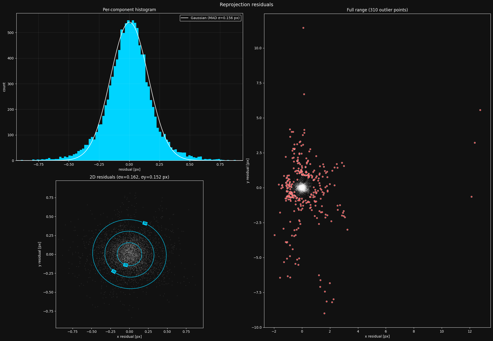

The extreme distortion of the board in my images caused the detector to start failing, causing the dense mass of outliers. After fixing my image taking strategy, the plot looked normal.

### Per-frame residuals

It's important to understand where your camera model struggles the most. The most useful way to inspect this is to first look at the `plot_per_image_rms()` plot. It shows you the RMS error per frame, including and excluding outliers. Let's take a look at this plot for the current calibration:

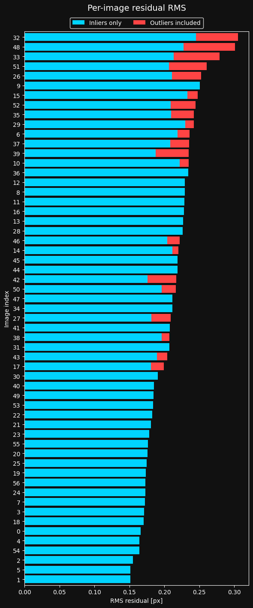

Looks like there are some frames with more outliers than others. Let's use `plot_worst_residual_frames()` to inspect the top three:


Looking at these images, I see that the largest residuals are caused by the ChArUco detector struggling under the extreme distortion. I won't worry about this now, as it happens relatively sparsely in my dataset, and most of the detector errors are filtered out as outliers.

Here is the same distribution from the image set mentioned before, where I took my images too close at angles that were too sharp.

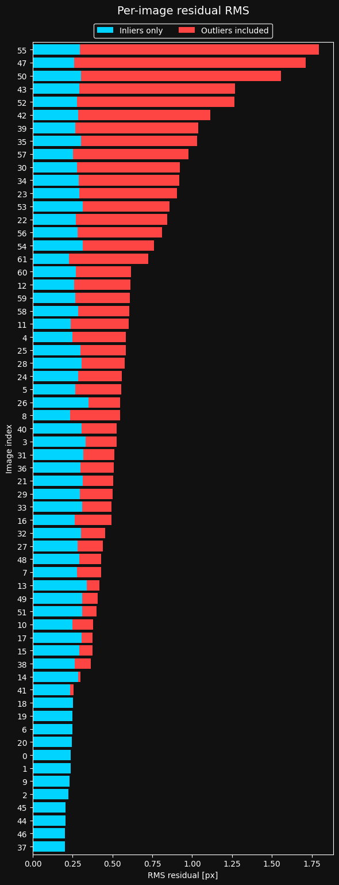

We clearly have a problem here. Too many images have really bad residuals that are filtered out as outliers. let's take a look at the top three worst frames on this plot:

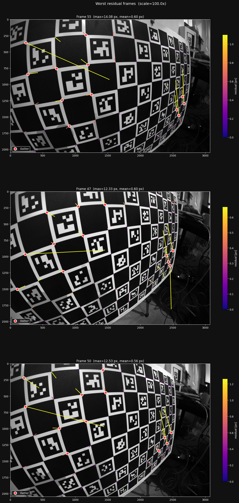

This is how I found the problem - the detector clearly is struggling in the extremely distorted parts of the board. I was taking my pictures in a way that made it too hard for the detector to detect the feature points reliably, so I had to change my image taking strategy.

### The residual grid

The residual plot is a great sanity check, but it deletes all spatial information - do the residuals behave differently in different regions of the image?

To analyze this, `lensboy` provides `plot_residual_grid()`. It bins the residuals in a grid over the image. Each grid cell is then colored according to the **mean norm of the residuals** in that bin, and shows the **mean residual** as a vector emanating from the center of the cell.

This gives you information about two things:

- **Are the residuals larger in some places than others?** If the residuals are systematically larger in some areas, this indicates underfitting or increased detection noise in those areas. Most commonly, it's the former, and you need to choose a more powerful model.
- **Do the residuals have directional biases anywhere in the image?** If this is the case, it is again very likely your model underfits the lens, and you need to choose a more powerful model.

When looking at the residual grid, it is important to only focus on the areas where you have plenty of data, and expect the lens model to be well constrained. It will usually look particularly messy towards the edges where data is sparse, and this is usually expected - your data doesn't constrain the model well there, so it will not fit well there.

Let's look at the residual grid for the model we fit earlier:


This looks _reasonable_. However, I still see a bit too much growth in residual norm and directional bias on the right side. I'd want to see if I can do better.

### Target warp

As mentioned earlier, `lensboy` estimates the warp of near-planar targets by default. It uses a 5-parameter Legendre polynomial model, which has worked well for me across a variety of targets. It can be useful to visualize the estimated warp with `plot_target_warp()`.

Let's take a look at the estimated warp for the model we fit earlier:

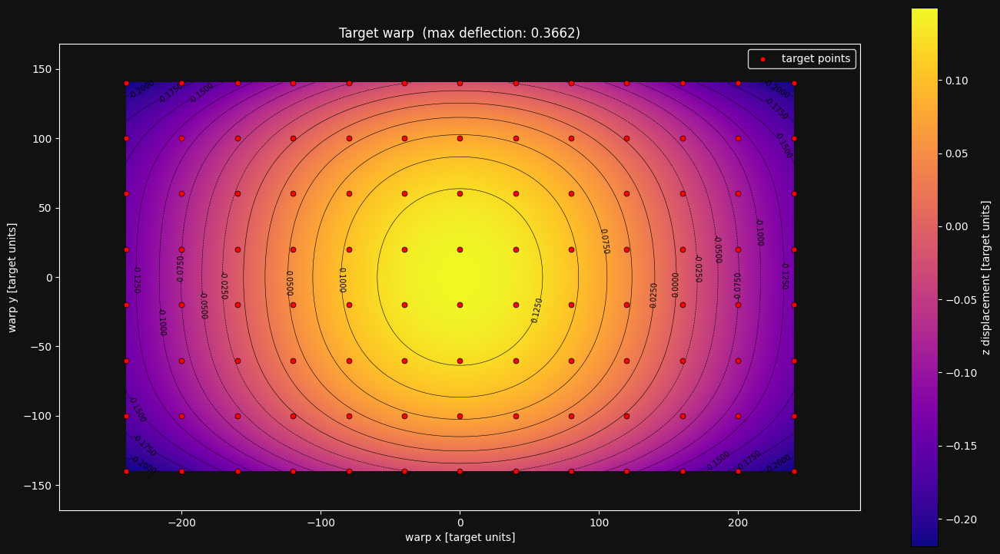

The warp estimation has a bowl shape that I see often for charuco boards. The spread is small (about 0.5mm), but still enough to matter. I haven't found any issues in my calibrations from looking at this plot, but I do find it interesting and informative. It would also be a red flag if the warp was estimated with an unreasonably large max deflection.

If we fit a model without enabling the target warp, and plot the residuals, we see that we get a wider residual distribution:

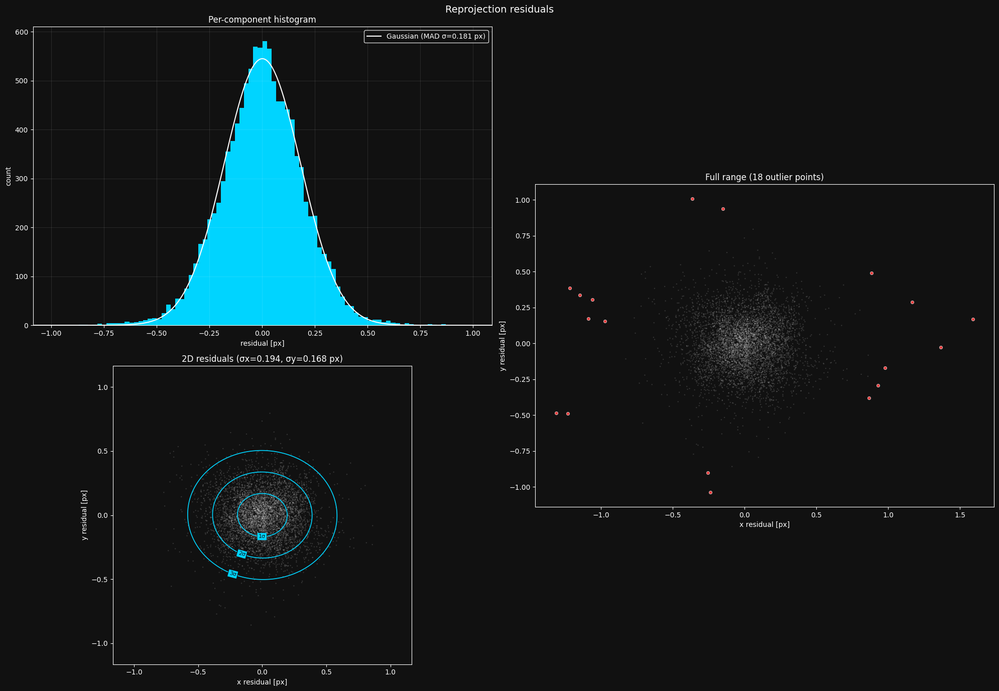

We have a higher MAD $\sigma$ - 0.18px vs the 0.13px we saw earlier. The smaller number of outliers is explained by the distribution being wider overall, causing a larger outlier threshold. We can also see more systematic issues in the residual grid:

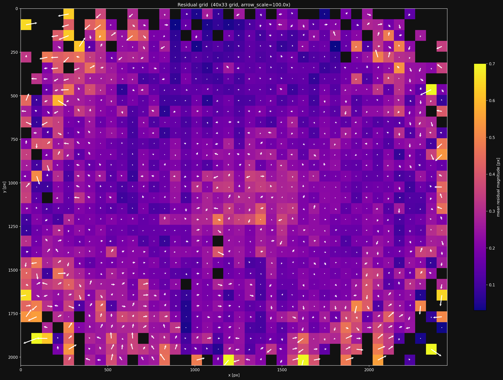

Most of the time, you should enable target warp estimation.

### The distortion pattern

`lensboy` provides the plot `plot_distortion_grid()` to visualize the projection function that your intrinsics define. This doesn't provide much concrete information about the quality of the fit, but is useful for your intuitive understanding of how the distortion model of your camera works.

Let's look at this plot for our camera model:

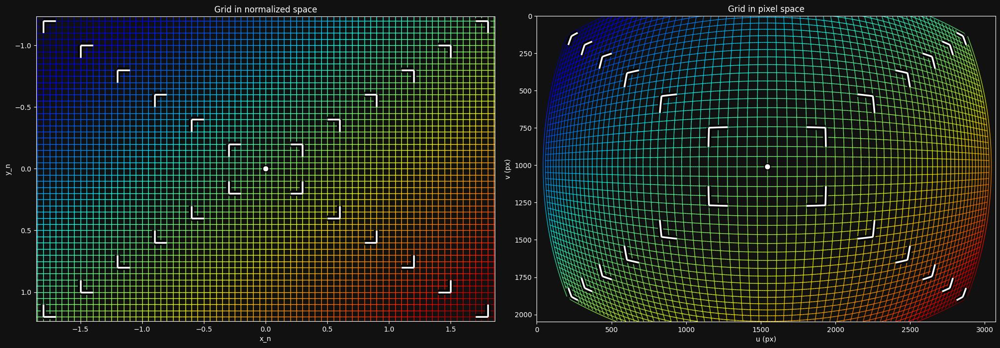

The left side shows a grid at the $z=1$ plane in camera frame, and the right shows how that grid is transformed into image space. We can clearly see that my wide-angle lens introduces a large amount of distortion.

### Cross-validation via model differencing

We've seen how we can figure out if our model is underfitting. But how can we know whether it is overfitting?

In principle, overfitting has two main characteristics:

- The model behaves erratically between data points, where it is less constrained
- The model flexes to exactly match noisy data, so it will make incorrect predictions on new observations.

A key insight is that because the model behaves erratically between data points, and it bends to noise in the data, you should get different projection models based on the specific dataset you fit them on, even if they are from the same distribution.

This means we can diagnose overfitting by splitting our dataset into two parts, fit a model on each part, and compare the models. If they differ a lot, we are likely overfitting.

To compare two different lens models, we can sample a grid on the image of the first model, and unproject it. We then project it into the second lens model, and look at the difference in the pixel values.

A small complexity in this approach is that different camera models, even of the same camera, imply a different camera frame relative to the physical camera. We need to find the difference between these two camera frames to be able to fairly compare the models. This is explained in detail in [this mrcal article](https://mrcal.secretsauce.net/differencing.html), so I won't go into the details here. One result of this is that you need to choose a (possibly infinite) distance at which to compare the models.

This model comparison is easily done with `lensboy` using the `plot_projection_diff()` plot. I'll start by splitting my dataset into two sets:

```python
frames_a = frames[0::2]
frames_b = frames[1::2]
```

Now let's fit two instances of the same model on the two sets:

```python
model_a = lb.calibrate_camera(target_points, frames_a, config)
model_b = lb.calibrate_camera(target_points, frames_b, config)
```

Now that we have the two models, let's take a look at `plot_projection_diff()`:

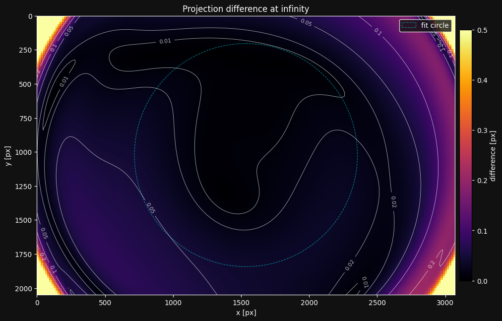

The left side shows the magnitude of the projection difference between the models. This looks pretty reasonable! The models differ by less than 0.1 pixel in most of the image, so the model is not overfitting.

> **Rule of thumb:** Be concerned if there are widespread differences of more than 2x the MAD $\sigma$ from the residual plot.

The right side shows the pattern of the projection difference. In reality the differences are usually imperceptibly small, so they are exaggerated.

One thing to look out for is the "fit circle". Its interior is the area of the image we use to find the difference between the implied camera frames of the models. This should only cover areas of the image where you expect good intrinsics. If it goes out of that area, this plot will not be realistic, and you need to adjust the `radius` argument to `plot_projection_diff()`.

Another very useful way to use this plot is when you're investigating whether your camera's intrinsics have drifted - that is, whether something changed mechanically in the camera. You can recalibrate the suspected camera, and look at the projection difference between the new and old calibration.

## 8. Splined Models

The OpenCV model from section 6 fits my lens reasonably well, but the residual grid showed directional bias on the right side of the image, so I think I can do better. For my application I want to push for maximum precision, so let's see if a more flexible model can reduce the residuals further.

Spline-based models use B-spline grids to model distortion, and so can model more arbitrary distortion patterns. However, they are also more prone to overfitting due to their flexibility, and thus require more data to constrain properly.

`lensboy`'s splined models are based on [mrcal splined lens models](https://mrcal.secretsauce.net/docs-2.2/splined-models.html), which provides a detailed explanation on how they work.

We can configure a spline model in `lensboy` with `PinholeSplinedConfig`. You control how flexible the model is by tuning the spline grid density.

I usually start with a 30x20 grid and then adjust the density based on the residual grid and cross-validation plots. Let's fit one:

```python
config = lb.PinholeSplinedConfig(
    image_height=image_height,
    image_width=image_width,
    initial_focal_length=1000,
    num_knots_x=30,
    num_knots_y=20,
)

result = lb.calibrate_camera(target_points, frames, config)
```

Let's take a look at `plot_residuals()`:


The fit is tighter, the MAD sigma going from 0.13px to 0.09. There are a bit more outliers, owing to the tighter distribution. Let's take a look at `plot_residual_grid()`:


This looks much better than our previous model. There is less directional bias and there is less pattern in the residual magnitudes. Specifically, we've reduced the amount of error in the right side of the image.

Let's take a look at what this spline model's projection function looks like with `plot_distortion_grid()`. I'll show the spline knots by setting `show_spline_knots` to `True`:


The distortion looks very similar to our previous model. One thing to note is that the spline-based models can look a bit strange where they are underconstrained, such as in the top right corner for our model. This is nothing to worry about unless you require good intrinsics in those areas. In those cases, you need to constrain the distortion model with more data in those areas.

Let's do a quick cross-validation and look at the projection diff with `plot_projection_diff()`:

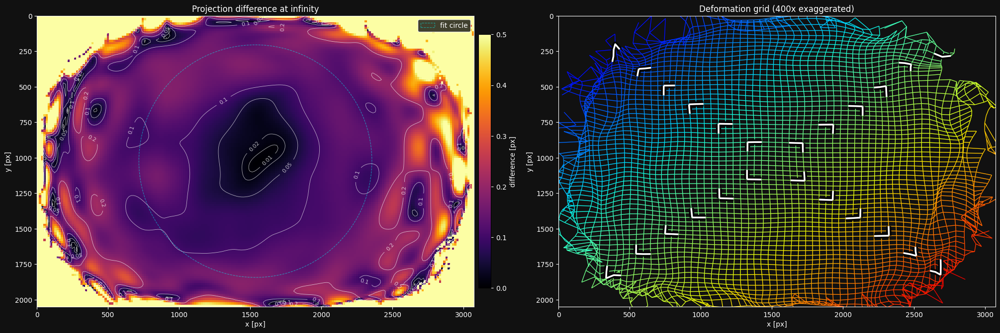

Interesting - the differences are a bit larger than what we saw for the previous model. It indicates that we might be approaching overfitting. However, I'll follow my rule of thumb - most of the difference in the image is smaller than ~0.2px, so I would happily use this model.

## 9. Using your model

After calibrating a good lens model, you'll obviously want to save, load, and use it. `lensboy` focuses on calibration rather than runtime use, so it makes it easy to convert your models into OpenCV-compatible formats for deployment.

### OpenCV models

OpenCV-style models are particularly convenient because the parameters are widely supported across languages and frameworks. All models can be saved and loaded with `model.save(path)` and `OpenCV.load(path)` as json files.

You can then extract the standard OpenCV parameters and use them anywhere:

```python
K = model.K()
dist_coeffs = model.distortion_coeffs
image_width = model.image_width
image_height = model.image_height
```

These are standard OpenCV parameters that work with `cv2.projectPoints`, `cv2.undistortPoints`, `cv2.solvePnP`, etc.

In my work we use a similar lens+sensor combination for localization from detections of a known world map. The precision requirements are slightly more lenient there, so we choose the OpenCV model for its simplicity of use.

### Spline models

You can save and load a spline-based model in the same way as for OpenCV models with `model.save(path)` and `PinholeSplined.load(path)`.

However, since standard tools do not support `lensboy` spline models, you'll need to use them slightly differently.

Of course, you can use `lensboy` directly to project/unproject:

```python
model = lb.PinholeSplined.load("my_spline_model.json")

# Project 3D points in camera frame to pixel coordinates
pixels = model.project_points(points_in_cam)

# Normalize pixel coordinates to camera-frame rays (z=1)
rays = model.normalize_points(pixel_coords)
```

If your application only needs camera-frame rays from pixel coordinates (e.g. for PnP or ray-casting), you can use `PinholeSplined` directly and skip the undistortion step entirely.

For applications that work with the images directly, you'll need to undistort your images to remove the spline distortion. To do this, you convert your `PinholeSplined` model into a `PinholeRemapped` model. A `PinholeRemapped` model consists of a vanilla pinhole model along with OpenCV-compatible undistortion maps that undistort your image to match the pinhole model.

You can do this with `get_pinhole_model()`, which returns a matching `PinholeRemapped` model. Since I will be doing stereo vision, I'll take this route. Since the undistortion maps are pretty large, I'll save the spline model directly, and generate a `PinholeRemapped` as soon as I load it.

```python
spline_model = lb.PinholeSplined.load("calibration.json")

# export to a pinhole model
pinhole_model = spline_model.get_pinhole_model(fx=1100, fy=1100)

# Now I can undistort images
undistorted_img = pinhole_model.undistort(img)

# and use the standard pinhole model directly with opencv
K = pinhole_model.K()
```

The `fx` and `fy` parameters control the focal length of the output pinhole model. Higher values zoom in, preserving detail in the center but cropping the edges of the field of view. Lower values preserve the full field of view but compress the center, reducing the effective resolution there. In the case of a wide-angle lens, this tradeoff is particularly pronounced. Let's use `plot_undistortion()` to see what our choice of `fx=1100, fy=1100` looks like:

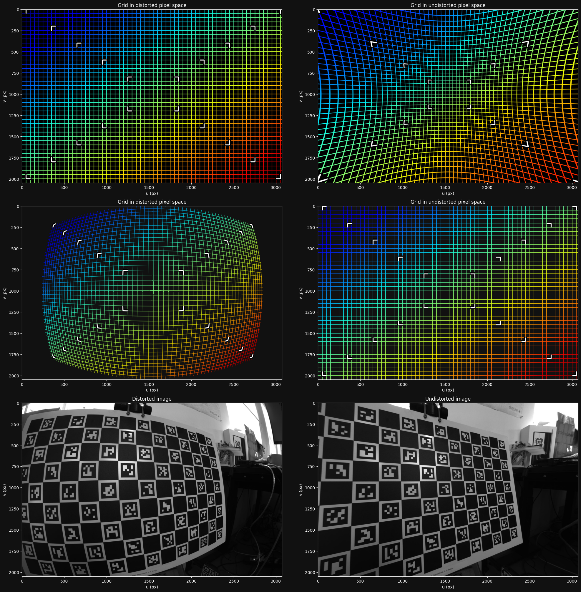

With these values, we throw away the edges of the distorted image in order to keep all of the information in the interior.

Here is an example of an undistortion map that makes the opposite tradeoff, compressing the information in the interior to keep all the information of the distorted image:

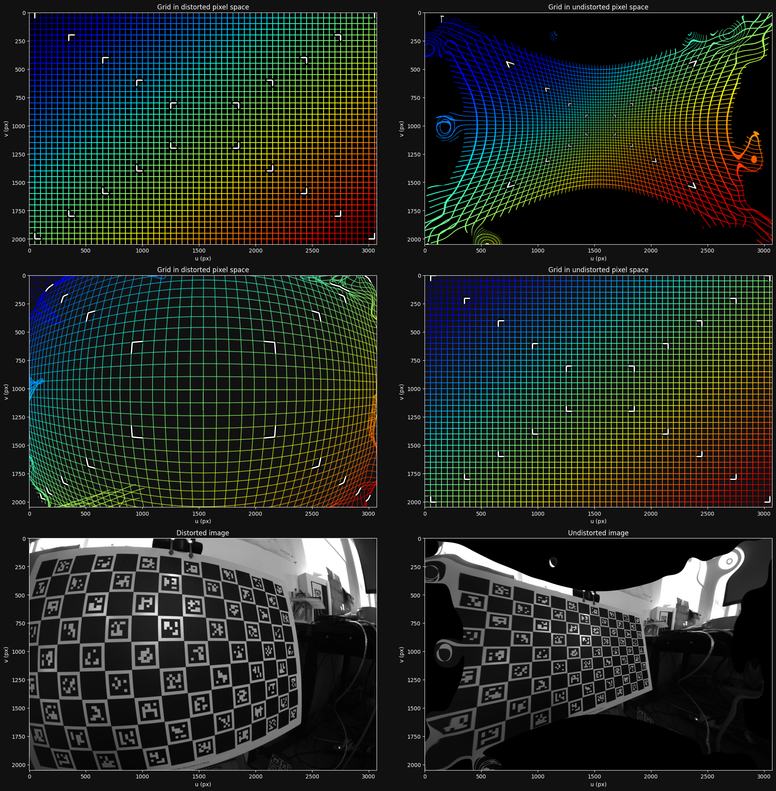

Notice how the center of the distorted image is dramatically compressed in the undistorted image.

## 10. Conclusion

Intrinsics can make or break a vision application. Bad intrinsics cause subtle, systematic errors that propagate through everything downstream - localization, stereo, measurements - and they are notoriously hard to trace back to the calibration. You can spend days debugging a system only to find that the root cause was a slightly off calibration. It is just easier to work when you can trust your intrinsics, so it's worth getting them right.

To see concrete code examples, see the [example notebooks](../examples/)
